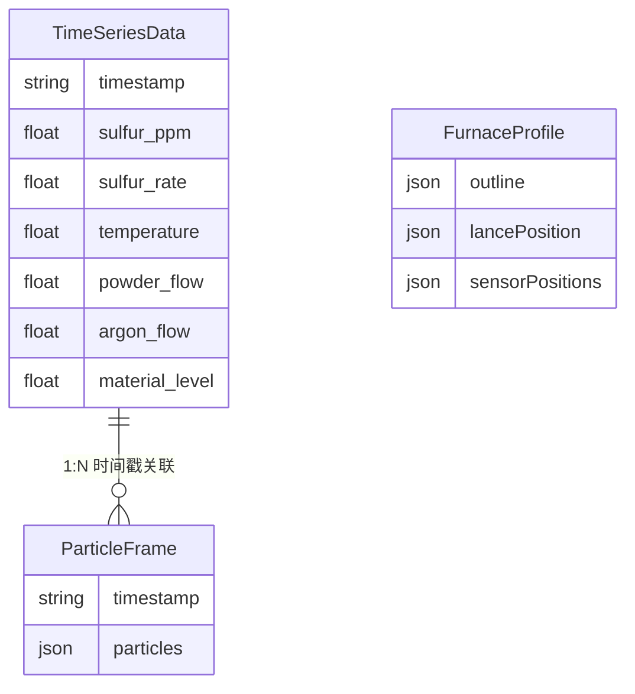

## 1. 架构设计

```mermaid
graph TB
    subgraph "数据层"
        "Python Pandas/NumPy" --> "CSV数据清洗"
        "CSV数据清洗" --> "时序对齐"
        "时序对齐" --> "JSON输出"
    end
    subgraph "前端展示层"
        "React App" --> "Deck.gl 粒子引擎"
        "React App" --> "ECharts 曲线引擎"
        "React App" --> "时间轴控制器"
        "Deck.gl 粒子引擎" --> "WebGL Canvas"
        "ECharts 曲线引擎" --> "Canvas/SVG"
    end
    subgraph "数据流"
        "JSON输出" --> "Vite Static Assets"
        "Vite Static Assets" --> "React App"
        "时间轴控制器" --> "Deck.gl 粒子引擎"
        "时间轴控制器" --> "ECharts 曲线引擎"
    end
```

## 2. 技术说明

- **前端框架**: React@18 + TypeScript + Vite
- **样式方案**: TailwindCSS@3
- **粒子可视化**: deck.gl@9 + @deck.gl/core + @deck.gl/layers (WebGL散点图层)
- **曲线可视化**: echarts@5 + echarts-for-react
- **数据层**: Python 3 + Pandas + NumPy（数据预处理脚本，输出JSON供前端消费）
- **动画**: requestAnimationFrame + deck.gl 动态更新
- **后端**: 无（纯前端 + 静态JSON数据文件）

## 3. 路由定义

| 路由 | 用途 |
|------|------|
| / | 主监控大屏（唯一页面，全屏展示） |

## 4. API 定义

无后端API。所有数据通过Python脚本预处理后输出为静态JSON文件，前端直接加载。

### 数据文件结构

```typescript
interface TimeSeriesData {
  timestamp: string;
  sulfur_ppm: number;
  sulfur_rate: number;
  temperature: number;
  powder_flow: number;
  argon_flow: number;
  material_level: number;
}

interface ParticleData {
  timestamp: string;
  particles: Array<{
    x: number;
    y: number;
    concentration: number;
    velocity: number;
  }>;
}

interface FurnaceProfile {
  outline: Array<[number, number]>;
  lancePosition: [number, number];
  sensorPositions: Array<{
    id: string;
    x: number;
    y: number;
    type: 'temperature' | 'flow' | 'level';
  }>;
}
```

## 5. 服务器架构

无需服务器。纯静态部署。

## 6. 数据模型

### 6.1 数据模型定义



### 6.2 数据处理流水线

1. **CSV读取**: Pandas read_csv 分块读取数十GB文件
2. **时间戳清洗**: 统一格式，去除异常值，填充缺失值
3. **采样率对齐**: 不同传感器(1Hz/5Hz/10Hz)重采样到统一1Hz
4. **硫含量计算**: 基于喷粉量与吹氩量计算硫含量下降模型
5. **微积分计算**: NumPy数值微分计算下降速率，梯形积分计算累计脱硫量
6. **粒子坐标生成**: 基于喷枪位置与浓度分布模型生成粒子坐标
7. **JSON输出**: 输出前端可消费的静态JSON文件
